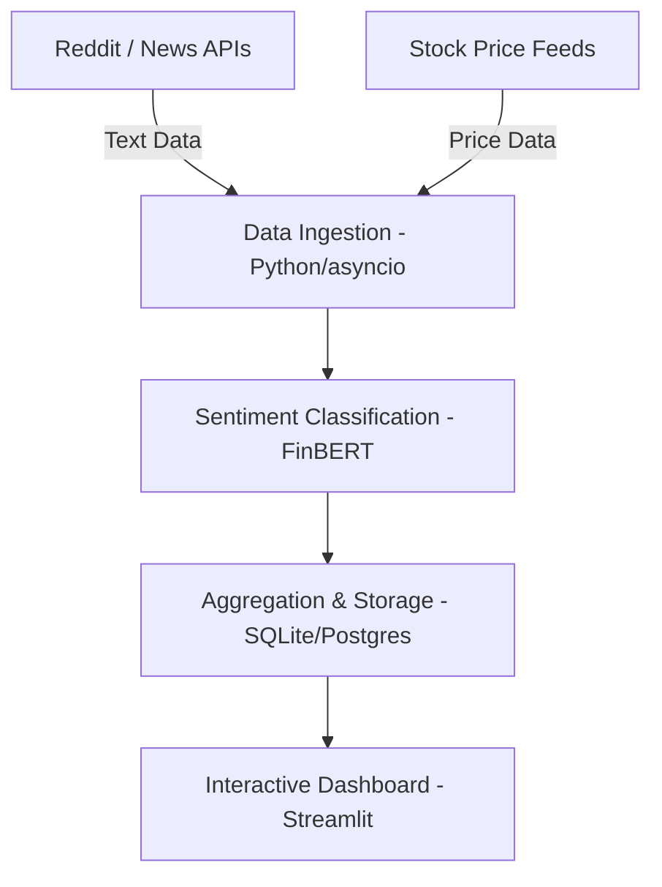

# Stock Sentiment Analytics

A real-time platform that **tracks, classifies, and visualizes market sentiment** around stocks using data from social media, news, and market feeds.  
By combining **real-time data collection, FinBERT-based sentiment analysis, and interactive dashboards**, it reveals how public sentiment correlates with stock price movements and volatility.

---

## Features
- **Real-Time Data Streams**  
  - Scrapes and aggregates stock mentions from Reddit (r/wallstreetbets, r/investing) and financial news APIs.  
  - Integrates intraday stock price data (via Yahoo Finance or Alpaca).  

- **Sentiment Classification**  
  - Uses **FinBERT** (a transformer model fine-tuned for financial text) to classify posts and headlines as positive, negative, or neutral.  
  - Aggregates scores by ticker and time window for trend tracking.  

- **Interactive Dashboard**  
  - Visualizes sentiment trends alongside stock price and volume data.  
  - Displays trending tickers, sentiment heatmaps, and alerts for significant shifts in market mood.  

- **Extensible Architecture**  
  - Modular codebase for adding new data sources, backtesting sentiment strategies, or deploying trading signals.

---

## Tech Stack
- **Python** (Pandas, NumPy, asyncio for streaming)  
- **APIs:** PRAW (Reddit), NewsAPI, yfinance/Alpaca (stock data)  
- **NLP:** Hugging Face Transformers (FinBERT)  
- **Database:** SQLite or PostgreSQL for storing historical data  
- **Visualization:** Streamlit or Plotly Dash  
- **Deployment:** Streamlit Cloud / Docker

---

## Architecture Overview



---

## Project Structure

```
market-sentiment-analyzer/
├── dashboard.py              # Streamlit dashboard frontend
├── stream_sentiment.py       # Backend data collection and sentiment analysis
├── utils.py                  # Utility functions and helpers
├── config.py                 # Configuration settings
├── run.py                    # Startup script for easy execution
├── requirements.txt          # Python dependencies
├── env_template.txt          # Environment variables template
├── README.md                # This file
└── .gitignore               # Git ignore file
```

## Getting Started

Follow these steps to set up and run the project locally.

### 1. Clone the Repository

```
git clone https://github.com/yourusername/stock-sentiment-analytics.git
cd stock-sentiment-analytics
```

### 2. Install Dependencies

```
pip install -r requirements.txt
```


### 3. Configure API Keys
Create a `.env` file in the project root and add your credentials:

```
NEWS_API_KEY=your_newsapi_key
```

### 4. Quick Start
Use the provided startup script to run the application:

```bash
# Run dashboard only (with sample data)
python run.py dashboard

# Run data collection stream only
python run.py stream

# Run both dashboard and data stream
python run.py both
```

### 5. Manual Start (Alternative)
If you prefer to run components manually:

**Start Data Collection:**
```bash
python stream_sentiment.py
```

**Launch Dashboard:**
```bash
streamlit run dashboard.py
```

The dashboard will be available at `http://localhost:8501`.
